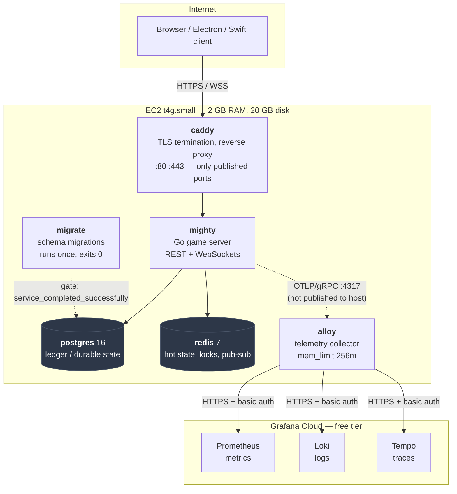
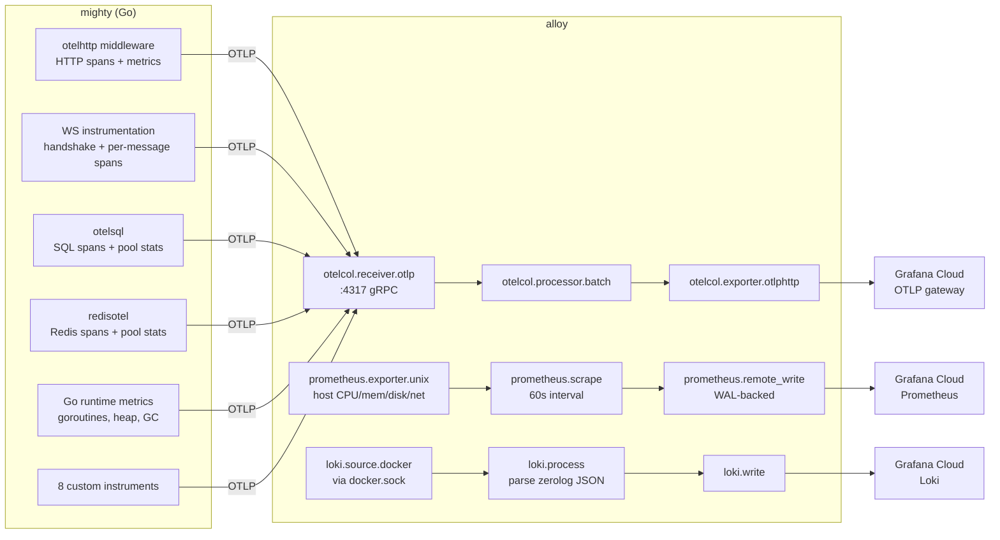
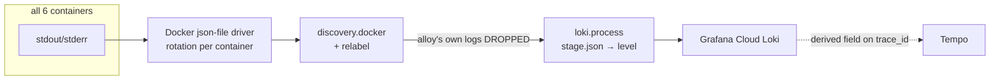
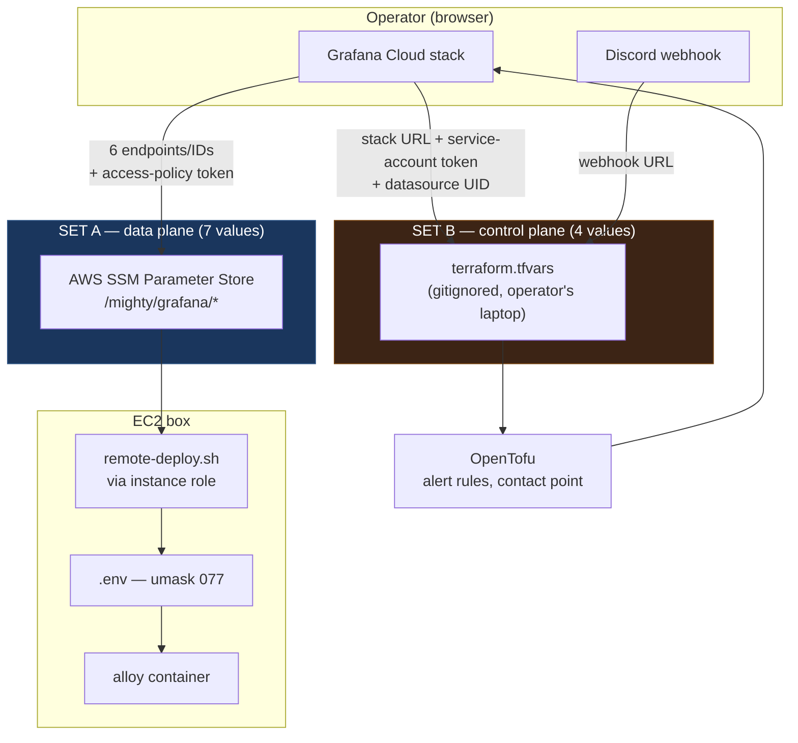
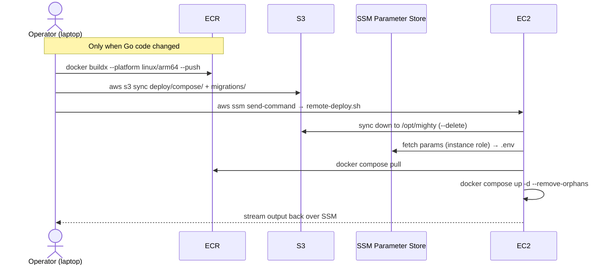

# Mighty — Runtime Architecture

How the production stack is wired: containers, telemetry, logging, and secrets.

**Scope:** what is actually deployed and verified working as of 2026-08-02, not
what was planned. Where something is deliberately absent or known-broken, it
says so.

**Host:** one EC2 `t4g.small` (2 vCPU / 2 GB RAM + 2 GB swap, ARM64/Graviton),
20 GB gp3 root volume, `us-east-1`. Everything below runs on that single box
via Docker Compose. Memory is the binding constraint on every decision here.

---

## 1. Containers



| Container | Role | Restart | Notes |
|---|---|---|---|
| `caddy` | TLS + reverse proxy | `unless-stopped` | **Only container publishing host ports** (80/443). Auto-renews certs. |
| `mighty` | Go game server | `unless-stopped` | REST + WebSockets. Depends on `migrate` completing, `redis`, and `alloy`. |
| `postgres` | Durable ledger | `unless-stopped` | Healthchecked; `migrate` waits on `service_healthy`. |
| `redis` | Hot state, locks, pub-sub | `unless-stopped` | Also backs the rate limiter (separate client). |
| `migrate` | `golang-migrate`, runs once | — | Exits 0; `mighty` gates on `service_completed_successfully`. |
| `alloy` | Telemetry collector | `unless-stopped` | `mem_limit: 256m`, `pid: host`. Sole egress path for telemetry. |

**`alloy` failing does not take the stack down.** `mighty` depends on it with
`condition: service_started`, which is satisfied by the container existing —
not by it staying healthy. A crash-looping collector must never break the game.
The trade-off is that it fails *quietly*, which is exactly why the
`telemetry_blind` alert exists.

---

## 2. Telemetry



### Trust boundary

`alloy` is the **only** container holding Grafana Cloud credentials and the
only egress path. `mighty` exports to `alloy:4317` over the Compose network
and never learns the vendor exists — swapping backends is a config change on
one container, not a rebuild.

The OTLP receiver binds `0.0.0.0:4317` *inside* the container. The Compose file
deliberately publishes no ports for `alloy`, so it is reachable from `mighty`
and nothing else.

### Instrumentation inventory

**Automatic:** HTTP request duration/count by route and status (`otelhttp`);
Go runtime metrics; `database/sql` pool stats including **waiting**
connections; Redis pool stats.

**Custom** (`internal/obs/metrics.go`) — chosen so the existing safeguards
become observable:

| Instrument | Labels | Why |
|---|---|---|
| `mighty.ws.handshake` | `kind`, `outcome` | Mirrors the WS safeguards: auth timeout, origin allowlist, per-user/per-IP conn caps |
| `mighty.ws.connections.active` | `kind` | Capacity truth; also reveals leaked connections |
| `mighty.ws.messages` | `type`, `outcome` | Is the 10/s + burst-20 limiter clamping real players? |
| `mighty.ratelimit.rejections` | `bucket` | Same question for the HTTP limiter |
| `mighty.games.created` | — | Product health |
| `mighty.moves` + `mighty.move.duration` | `outcome` | Engine correctness; an invalid-move spike means a client/server rules mismatch |
| `mighty.optimistic_conflicts` | — | State is version-tracked; conflict rate measures strain on it |

**Traces:** HTTP spans via `otelhttp`; SQL spans via `otelsql` (`OmitRows:
true` — one span per query, not per cursor); Redis spans via `redisotel`;
WebSocket handshake spans and **one root span per inbound message**.

### Two WebSocket decisions worth knowing

1. **WS routes are excluded from `otelhttp`** (`api.TraceFilter`). Its
   ResponseWriter wrapper does not reliably implement `http.Hijacker`, which
   `gorilla/websocket` requires — wrapping WS routes breaks every socket.
   `/healthz` is excluded too (the Route 53 probe would add ~2,900 meaningless
   spans/day).
2. **No span covers a whole connection.** Connections last an entire game; such
   a span is unusable in Tempo and pins SDK memory for hours. Instead: a
   short-lived handshake span (upgrade → AUTH → accept/reject), and a new root
   span per inbound frame. Spans are ended explicitly on every exit path,
   **never with `defer`** — a deferred end inside the read loop would hold every
   span open until the socket closed.

### THE CARDINALITY RULE

> `game_id`, `user_id`, `conn_id`, and client IPs are **span attributes and log
> fields only — never metric labels, never Loki labels, never span names.**

This is not style. Grafana Cloud's free tier caps at **10,000 series** and
**silently drops data** past it — the monitoring fails exactly when needed.

`TestNoForbiddenMetricLabels` (`internal/obs/metrics_test.go`) scans
`metrics.go` for forbidden attribute *key names*. **It does not check values,
and it does not cover other files.** Two real near-misses on this branch both
involved a client-controlled JSON field (`inMsg.Type`) reaching first a metric
label, then a span name — the guard caught neither. `wsMessageTypeLabel()`
collapses it to a bounded set; use it at every call site.

**When adding any metric or span name, ask: can this value come from a client,
and what is the finite set it belongs to?** If you can't name the set, it
doesn't belong there.

### No-op by default

With `OTEL_EXPORTER_OTLP_ENDPOINT` unset, `obs.Init` installs no-op providers:
no exporters, no network, no goroutines. Dev Compose has no collector and
`go test ./...` must not open sockets. Instrumentation is opt-in by env.

### Shutdown

`main()` catches SIGTERM/SIGINT, flushes telemetry (5s timeout), and exits.
It deliberately does **not** call `srv.Shutdown()` or drain connections —
WebSockets are long-lived, and deciding whether in-flight games get cut off or
waited on is a gameplay decision, not an observability one. Sockets die exactly
as they did before.

---

## 3. Logging



**Rotation — every container is bounded.** Docker's `json-file` driver is
unbounded by default; three services shipped without limits and accumulated 13
days of logs on the volume shared with the Postgres data directory.

| Container | max-size | max-file |
|---|---|---|
| `caddy`, `mighty`, `postgres` | 10m | 3 |
| `alloy`, `redis`, `migrate` | 5m | 2 |

**The feedback loop.** `loki.source.docker` discovers *all* containers
including Alloy — and Alloy logging about shipping logs generates logs to ship.
A relabel rule drops any container matching `/?.*alloy.*`, and Alloy runs at
`info`, never `debug`.

**Loki labels: `service`, `container`, `level`, `env`. Nothing else.**
Specifically **`trace_id` must never be a label** — it is unbounded and would
create one log stream per trace. It stays a JSON *field*, linked to Tempo via a
derived field on the Loki datasource (regex `"trace_id":"(\w+)"`).

`discovery`'s per-container `filename` label is dropped — it contains the
container ID and would create a new stream on every recreate.

**Application logs** are zerolog structured JSON. `obs.Log(ctx)` returns a
`*zerolog.Logger` with `trace_id`/`span_id` bound when the context carries a
span, and the plain global logger otherwise. It returns a **pointer** because
zerolog's `Info()`/`Warn()`/`Error()` have pointer receivers — a value return
makes the chained `obs.Log(ctx).Warn()` form uncompilable.

`LoggingMiddleware` emits **exactly one line per request** carrying `method`,
`url`, `remote`, `responseCode`, `duration`, and trace IDs when available.

---

## 4. Secrets



### Two disjoint credential sets — do not mix them

| | Set A — data plane | Set B — control plane |
|---|---|---|
| **Stored in** | AWS SSM Parameter Store | `deploy/terraform/terraform.tfvars` |
| **Read by** | `remote-deploy.sh` on the box, via the EC2 instance role | OpenTofu, on the operator's laptop |
| **Purpose** | *Send* telemetry | *Manage* alert rules and contact points |
| **Token type** | Access policy (`metrics:write`, `logs:write`, `traces:write`) | Service account (Admin role) |
| **Never touches** | Terraform, the laptop | SSM, the EC2 box |

**The two tokens are different tokens and are not interchangeable.**

### Set A — SSM (7 parameters)

| Parameter | Type | Secret? |
|---|---|---|
| `/mighty/grafana/otlp_endpoint` | String | no — URL, must end `/otlp`, no trailing slash |
| `/mighty/grafana/otlp_instance_id` | String | no |
| `/mighty/grafana/prom_url` | String | no — must end `/api/prom/push` |
| `/mighty/grafana/prom_user_id` | String | no |
| `/mighty/grafana/loki_url` | String | no — must end `/loki/api/v1/push` |
| `/mighty/grafana/loki_user_id` | String | no |
| `/mighty/grafana/token` | **SecureString** | **yes** |

Plus pre-existing: `/mighty/postgres_password`, `/mighty/cognito_pool_id`,
`/mighty/cognito_client_id`, `/mighty/api_domain`, `/mighty/acme_email`.

**The three numeric IDs are different values** — one per backend. A mismatch
surfaces only as a `401` in Alloy's logs. The URLs must carry their full push
paths: a missing `/push` gives `404`; a wrong Loki path gives `405`.

### Set B — tfvars (4 values)

`grafana_url`, `grafana_sa_token` (sensitive), `discord_webhook_url`
(sensitive), `prom_datasource_uid`.

### Terraform must not read Set A

Terraform stores **data source** results in state in plaintext, exactly as it
stores managed resources. State here lives in an S3 backend
(`mighty-tfstate-711387141487`, key `mvp/terraform.tfstate`) — so it is not on
anyone's laptop, and S3 encrypts at rest. That is meaningfully better than a
local state file, but it does not make the copy free: the token would be
readable by anyone with read access to that bucket, and it would sit in every
historical state version.

The decisive argument is simpler and doesn't depend on where state lives:
**nothing in the config references those parameters.** Only `remote-deploy.sh`
needs them, and it reads SSM directly on the box via the instance role. A copy
at rest with no consumer is pure downside.

> A secret should be read by exactly the thing that uses it, as late as
> possible. Routing it through a tool that only passes it along adds a copy at
> rest and buys nothing.

### How Set A reaches the container

`deploy.sh` (laptop) syncs `deploy/compose/` → S3 → `/opt/mighty` on the box,
then runs `remote-deploy.sh` over SSM. That script fetches each parameter with
`aws ssm get-parameter --with-decryption` using the instance role and writes
`.env` under `umask 077`. Compose passes it to `alloy` via `env_file`, and
`config.alloy` reads them with `sys.env(...)`.

`.env` never exists in S3 or git. The first sync runs with `--delete`, so it is
removed and regenerated on every deploy — expected, not a bug.

### Known exposure

`terraform.tfvars` holds three secrets in cleartext on the operator's laptop:
a GitHub PAT (pre-existing), the Grafana service-account token, and the Discord
webhook URL. Gitignored and untracked, but unencrypted. The service-account
token is the widest-reaching — org Admin can delete dashboards and data
sources, not just manage alerting. **Set an expiry on it.**

---

## 5. Alerting

Deployed rules live in `deploy/terraform/grafana.tf`, routed to Discord.

| Rule | Condition | Severity |
|---|---|---|
| `telemetry_blind` | no host metrics for 10m | critical |
| `memory_exhausted` | `MemAvailable` < 150 MB for 10m | critical |
| `disk_filling` | root volume < 15% free for 15m | critical |

Retained separately and deliberately: the **CloudWatch** alarms in
`alarms.tf` — EC2 `StatusCheckFailed`, a Route 53 HTTPS probe on `/healthz`,
and a $25/$30 budget tripwire. These are **out-of-band**: they work precisely
when the in-band Grafana path is dead. This design adds a layer and deletes
nothing.

### Two rules that must be respected

1. **Every expression must return exactly one series valued 0 or 1, in every
   state.** With `no_data_state = "Alerting"`, an expression returning *no
   series* is indistinguishable from an emergency — such a rule fires on
   install and never clears, which trains you to mute the channel. Use the
   `bool` modifier; do **not** use bare `absent()` (it returns an *empty
   vector* when data exists — use `(count(v) * 0) or vector(1)`).
2. **Alloy must be scraping before `tofu apply`.** Otherwise all three rules
   see No Data and page you for your own installation.

Also note: node_exporter strips `rootfs_path` from the exposed `mountpoint`
label, so the host root is `mountpoint="/"`, never `/rootfs` — despite being
bind-mounted there.

---

## 6. Deploy flow



**`--platform linux/arm64` is mandatory** — the box is Graviton, and an amd64
image fails at container start, not at build time.

### A real trap in this pipeline

`aws s3 sync` compares **size and mtime**. A same-length edit — flipping a
comparison operator, changing a digit, renaming `max_keep_alive_time` to
`max_keepalive_time` while preserving column alignment — can be **silently
skipped**, leaving the box on the old file while every command reports success.

If a config change doesn't seem to take effect, check all three:

```bash
grep <pattern> deploy/compose/<file>                              # laptop
aws s3 cp s3://mighty-deploy-<acct>/bundle/compose/<file> - | grep <pattern>   # S3
grep <pattern> /opt/mighty/<file>                                 # box
```

Adding `--exact-timestamps` to the box-side sync in `deploy.sh` would close
this. **Not yet done.**

### Validate Alloy config before deploying

```bash
docker run --rm -v "$PWD/deploy/compose/alloy:/cfg" grafana/alloy:v1.10.0 validate /cfg/config.alloy
```

Use **`validate`, not `fmt`.** `fmt` checks River syntax only and happily
accepts an attribute name that doesn't exist — verified: it exits 0 on a config
that crash-loops on the box.

---

## 7. Known gaps

| Gap | Impact |
|---|---|
| **`postgres.UpdateGameStatus` is never called** | `games.status` is frozen at creation, so `ListGamesByStatus` — which backs `GET /games` for the lobby — **reads stale status**. A pre-existing product bug. It is why `mighty.games.active` / `.completed` don't exist. |
| Container metrics (cadvisor) disabled | No per-container CPU/memory. Gated on measured headroom; heaviest component on a 2 GB box. |
| Data race under `go test -race -count>=2` | Test-only: a global logger swap racing a hijacked-connection goroutine that outlives its test. CI has no `-race` today; will bite when added. |
| `obs.StartWSMessageSpan` doesn't clamp its own input | Sanitisation lives at the single call site. This bug class has occurred twice via different paths — clamping inside the helper is a 2-line fix. |
| 4 unwrapped `errors.New` in `internal/game/rules.go` | Some move rejections record `outcome=error` instead of `outcome=invalid` |
| `otelhttp` `server.address` from client `Host` header | Bounded only because Caddy pins one site; `WithServerName` would decouple it |
| Frontend telemetry | Out of scope — different problem shape |
| Sampling at 100% | Tunable via `OTEL_TRACES_SAMPLER_ARG` without a rebuild. Watch trace volume against the 50 GB/month ceiling. |

---

## 8. Where things live

| Path | What |
|---|---|
| `internal/obs/` | OTel lifecycle, instruments, trace helpers, trace-aware logging |
| `internal/api/` | HTTP + WS handlers, `TraceFilter`, `wsMessageTypeLabel` |
| `deploy/compose/alloy/config.alloy` | All Alloy pipelines |
| `deploy/compose/docker-compose.prod.yml` | Production stack |
| `deploy/compose/remote-deploy.sh` | Fetches secrets, writes `.env`, runs Compose |
| `deploy/terraform/grafana.tf` | Provider, folder, contact point, notification policy, alert rules |
| `deploy/terraform/alarms.tf` | CloudWatch out-of-band alarms — **do not remove** |
| `docs/superpowers/specs/2026-07-25-*` | Design spec and rationale |
| `docs/superpowers/plans/2026-07-25-*` | Implementation plan, incl. a table of 12 defects found during execution |
