# Mighty Deployment Architecture & Process

This document outlines the deployment pipeline for the Mighty Go application, detailing how code goes from a local machine to running in production on AWS.

## Architecture Diagram

Below is a sequence diagram illustrating the deployment flow:

```mermaid
sequenceDiagram
    actor Dev as Developer
    participant ECR as Amazon ECR
    participant S3 as Amazon S3
    participant SSM as AWS Systems Manager
    participant EC2 as EC2 Instance

    %% Step 1: Build & Push
    rect rgb(20, 20, 30)
    Note over Dev,ECR: 1. Application Build
    Dev->>ECR: Login to registry (aws ecr get-login-password)
    Dev->>ECR: docker buildx build --platform linux/arm64 --push
    end

    %% Step 2: Trigger Deployment
    rect rgb(20, 30, 20)
    Note over Dev,SSM: 2. Trigger Deployment (deploy.sh)
    Dev->>S3: Sync deploy/compose/* & migrations/ (aws s3 sync)
    Dev->>SSM: Trigger AWS-RunShellScript (aws ssm send-command)
    end

    %% Step 3: Remote Execution
    rect rgb(30, 20, 20)
    Note over SSM,EC2: 3. Remote Execution (remote-deploy.sh)
    SSM->>EC2: Execute /opt/mighty/remote-deploy.sh
    EC2->>S3: Download config and migrations to /opt/mighty
    EC2->>ECR: docker pull mighty:latest
    EC2->>EC2: Inject SSM parameters into .env file
    EC2->>EC2: docker compose -f docker-compose.prod.yml up -d
    EC2->>Dev: Stream logs back via SSM (aws ssm get-command-invocation)
    end
```



---

## The Deployment Process (Step-by-Step)

The deployment pipeline is split into two distinct phases: **Building the Image** (manual) and **Deploying the Configuration** (automated via `deploy.sh`).

### Phase 1: Building and Pushing the Application (Manual)
The Go application is containerized and pushed to Amazon Elastic Container Registry (ECR). **Important:** Because the production EC2 instance uses an AWS Graviton processor, the image must be explicitly built for the `linux/arm64` architecture.

1. **Authenticate Docker with ECR:**
   ```bash
   aws ecr get-login-password --region us-east-1 | docker login --username AWS --password-stdin 711387141487.dkr.ecr.us-east-1.amazonaws.com
   ```
2. **Build and Push:**
   ```bash
   docker buildx build \
     --platform linux/arm64 \
     -t 711387141487.dkr.ecr.us-east-1.amazonaws.com/mighty:latest \
     --push .
   ```

> [!NOTE]
> If changes are made to the `Dockerfile.caddy` or Caddy configuration, the custom Caddy image must also be rebuilt and pushed using `./deploy/scripts/build-caddy.sh`.

### Phase 2: Deploying to EC2 (`deploy.sh`)
Once the new Docker images are residing in ECR, you trigger the deployment script from your local machine:
```bash
cd deploy/scripts
./deploy.sh
```

This script orchestrates the following actions:

1. **Upload Configuration to S3:**
   The script uses `aws s3 sync` to upload everything in `deploy/compose/` (Caddyfile, docker-compose.prod.yml, remote-deploy.sh) and the `migrations/` directory to your designated deployment S3 Bucket. *Your Go binary is not uploaded here.*

2. **Trigger AWS Systems Manager (SSM):**
   The script invokes `aws ssm send-command` to tell the EC2 instance to execute a predefined shell command.

3. **Remote Deployment (`remote-deploy.sh`):**
   The EC2 instance receives the command and runs `remote-deploy.sh`. This script acts as the "on-server" agent and performs the heavy lifting:
   - Sets up the `/opt/mighty/` directory on the server.
   - Generates the `.env` file securely by fetching runtime secrets (Postgres passwords, Cognito IDs, etc.) from **AWS SSM Parameter Store**.
   - Authenticates the EC2 instance with Amazon ECR.
   - Runs `docker compose -f docker-compose.prod.yml pull` to fetch the new `mighty:latest` image you pushed in Phase 1.
   - Runs `docker compose -f docker-compose.prod.yml up -d --remove-orphans` to recreate any containers whose configuration or image has changed.
   - Cleans up dangling docker images to save disk space (`docker image prune -f`).

4. **Stream Output:**
   Finally, your local `deploy.sh` script polls AWS for the results of the SSM command and streams the standard output and standard error back to your terminal, allowing you to see the `remote-deploy.sh` logs in real-time.
