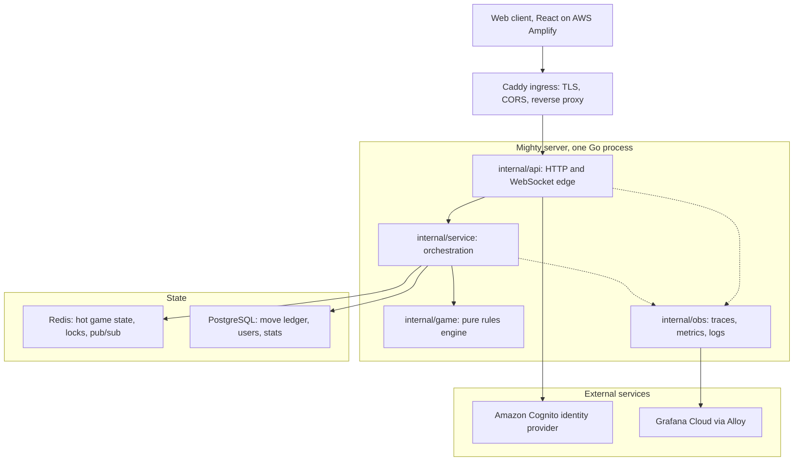
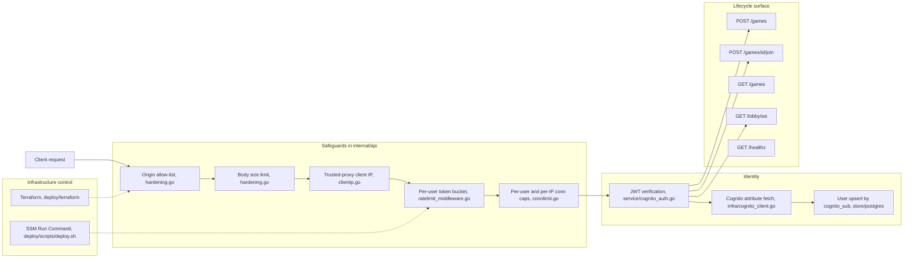
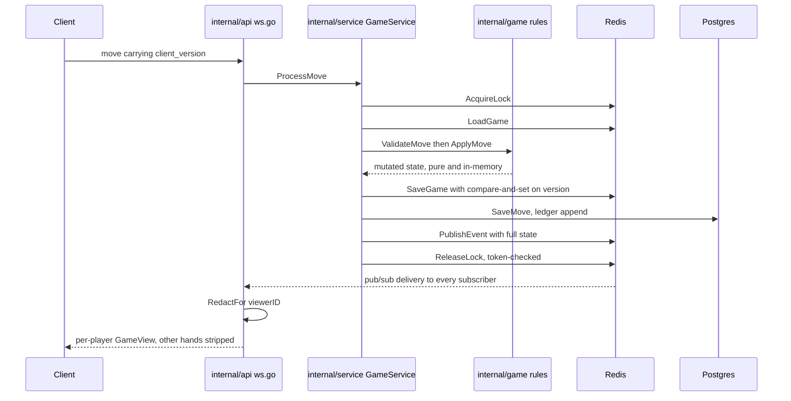
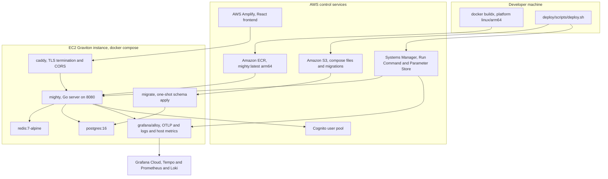
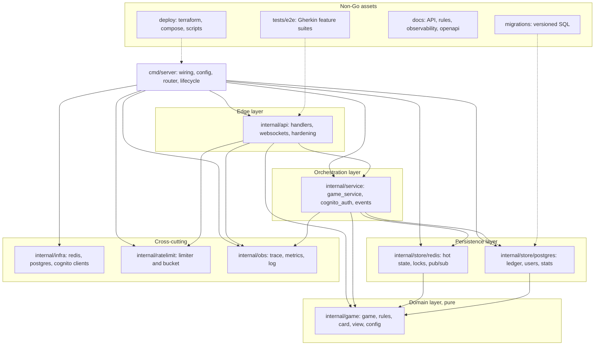

# Mighty Backend Engine 🃏🚀

A high-performance, real-time backend for the Mighty card game, built with Go, Redis, and PostgreSQL.

## 🚀 Key Features

- **Authoritative Engine**: Full implementation of Mighty rules, including special card power shifts (Mighty/Joker/Ripper).
- **Social Lobby**: Authenticated matchmaking lobby for game discovery.
- **Bi-Directional WebSockets**: Sub-millisecond move latency via real-time reactive streams.
- **UCLA Scoring**: Accurate implementation of campus-standard scoring and multipliers.
- **Optimistic Concurrency**: Version-tracked state updates to prevent race conditions.

---

## 🏛️ High-Level Architecture

The server is a single Go binary with a strictly layered dependency graph: HTTP/WebSocket edge → service orchestration → pure game engine, with stores at the bottom. The edge is the only layer that speaks to clients, and the only layer that decides what a given player is allowed to see.



Client traffic arrives over HTTPS and WSS; `internal/api` verifies Cognito-issued JWTs; `internal/obs` exports over OTLP.

The same architecture, split by concern, is described below as three planes.

### 🎛️ Control Plane

The control plane decides **who may do what**. It owns identity, admission, lifecycle transitions, and the infrastructure that shapes the running system. It never mutates card state directly.



`GET /games` and `GET /healthz` are unauthenticated; Terraform and SSM configure the safeguard values the edge enforces.

Control-plane responsibilities:

| Concern | Where | Notes |
| --- | --- | --- |
| Authentication | `internal/service/cognito_auth.go`, `internal/infra/cognito_client.go` | Cognito-issued JWTs verified against the pool issuer and client ID; users upserted by `cognito_sub`. |
| Authorization context | `internal/api/authctx.go` | Authenticated user ID is carried in request context and is the sole basis for redaction. |
| Rate limiting | `internal/ratelimit`, `internal/api/ratelimit_middleware.go` | Redis Lua token bucket (durable, cross-instance) plus an in-process bucket for per-connection message rates. Fails **open** on Redis trouble. |
| Connection admission | `internal/api/connlimit.go`, `clientip.go` | 3 sockets per user, 20 per IP. `TRUST_PROXY_HEADERS` governs whether `X-Forwarded-For` is honored. |
| Transport hardening | `internal/api/hardening.go` | Origin allow-list (`ALLOWED_ORIGINS`), body caps, header caps, `ReadHeaderTimeout`. |
| Game lifecycle | `internal/service/game_service.go` | Create (8-digit ID, creator at seat 0), idempotent join, auto-start and deal on the 5th player. |
| Discovery | `internal/api/lobby_ws.go` | Lobby socket broadcasting `LobbyGameView` envelopes; deliberately a distinct, narrower view type than `GameView`. |
| Provisioning & rollout | `deploy/terraform`, `deploy/scripts` | VPC, EC2, ECR, Cognito, Amplify, DNS, alarms, DLM snapshots; deploys are S3 sync + SSM Run Command. |

### 💾 Data Plane

The data plane moves **game state and events**. Redis is the source of truth for live games; Postgres is the immutable audit trail and identity store; Redis pub/sub is the fan-out bus. Redaction happens at the socket edge, never in storage.



Data-plane invariants:

- **Optimistic concurrency.** Every mutating move carries `client_version`; `SaveGame` performs a compare-and-set against the stored version, so a stale client loses rather than corrupting a trick.
- **Distributed locking.** Multi-step transitions (dealing, trick resolution, round reset) run under a token-scoped Redis lock; release is token-checked so a timed-out holder cannot unlock a successor.
- **Full state on the bus, redaction at the edge.** `GameEvent` carries the complete `*game.Game` because Redis is internal. `OutgoingGameEvent` carries a `*game.GameView`, and the relay decodes/re-encodes so any undeclared field is dropped rather than leaked.
- **Two stores, two jobs.** Redis holds hot, mutable, expiring state. Postgres holds append-only truth: the move ledger (`SaveMove`), game status transitions, users, and `user_stats`.
- **Schema evolution** lives in `migrations/`, applied by a dedicated `migrate` service in the production compose stack.

| Store | Contents | Access point |
| --- | --- | --- |
| Redis | Game JSON keyed per game, version counter, locks, per-game and lobby pub/sub channels | `internal/store/redis` |
| PostgreSQL | `games`, move ledger, `users`, `user_stats` | `internal/store/postgres` |

### 🖥️ Compute Plane

The compute plane is **where code executes**. One Go binary, containerized, behind Caddy, on a single Graviton EC2 instance, with the frontend served separately by Amplify.



Compute-plane characteristics:

- **Single stateful process.** No horizontal sharding today; Redis pub/sub is already the fan-out mechanism, so multi-instance is a deployment change rather than a rewrite. Rate-limit buckets are Redis-backed for the same reason.
- **arm64 only.** The production instance is Graviton, so images must be built `--platform linux/arm64`.
- **Flush-only shutdown.** `SIGTERM`/`SIGINT` flush telemetry and close the limiter's Redis pool, then exit. WebSockets are deliberately **not** drained: cutting off versus waiting on an in-progress game is a gameplay decision, not an observability one.
- **Startup resilience.** Postgres connect is retried 30× at 1s intervals; Cognito misconfiguration is fatal by design.
- **Observability is opt-in.** Everything in `internal/obs` is inert unless `OTEL_EXPORTER_OTLP_ENDPOINT` is set; locally, `docker compose --profile observability up` adds Alloy.
- **Deploy path.** Build/push to ECR → `aws s3 sync` config and migrations → SSM `AWS-RunShellScript` runs `remote-deploy.sh` on the instance → compose pulls and restarts. See [deploy/DEPLOY.md](./deploy/DEPLOY.md).

---

## 📦 Code Organization

Dependencies point strictly downward, and the graph below reflects the actual import edges (`go list`), not an aspiration. `internal/game`, `internal/ratelimit`, `internal/obs`, and `internal/infra` import nothing else from the project; `internal/api` reaches state only through `internal/service`.



Solid edges are Go import edges; dashed edges are the non-Go assets that exercise, define, or ship the packages they point at.

| Package | Responsibility | Rule of thumb |
| --- | --- | --- |
| `cmd/server` | Process entry: config from env, dependency wiring, `http.ServeMux` routes, signal handling, telemetry flush. | All configuration reading lives here. |
| `internal/api` | HTTP handlers, WebSocket upgrade and relay, auth context, hardening, rate-limit middleware, health. | The only place that serializes to clients, and therefore the only place that redacts. |
| `internal/service` | Orchestration: locking, version checks, store writes, event publishing, Cognito-backed auth. | Knows about I/O; contains no card rules. |
| `internal/game` | Deck, hands, phases, bidding, trick resolution, power matrix, scoring, per-player views. | Pure and deterministic — no context, no network, no clock dependence. |
| `internal/store/redis` | Hot state CAS writes, distributed lock, pub/sub publish/subscribe. | Serializes `game.Game`; never applies rules. |
| `internal/store/postgres` | Append-only move ledger, game status, users, stats. | Audit truth; safe to replay. |
| `internal/infra` | Raw client constructors: Redis, Postgres, Cognito IdP. | Connection concerns only, no domain types; wired from `cmd/server`. |
| `internal/ratelimit` | Redis Lua token bucket plus an in-process bucket. | Fails open on backend failure. |
| `internal/obs` | OTel tracer/meter providers, metric instruments, zerolog setup. | Inert without an OTLP endpoint. |

Tests live beside the code they cover (`*_test.go`), with executable specifications in `internal/game/features/` and end-to-end Gherkin suites in `tests/e2e/features/`.

---

## 🛠️ Manual Build Process

1. **Build the executable**:
   ```bash
   CGO_ENABLED=0 GOOS=linux GOARCH=amd64 go build -trimpath -ldflags="-s -w" -o mighty ./cmd/server
   ```
2. **Run the server**:
   ```bash
   ./mighty
   ```

## 🐳 Docker Deployment

1. **Setup Secrets**:
   ```bash
   cp secrets/postgres_password.txt.example secrets/postgres_password.txt
   # Edit secrets/postgres_password.txt with a strong, unique password
   ```
2. **Launch Stack**:
   ```bash
   docker compose up -d
   ```
3. **Optional — local telemetry shipping**:
   ```bash
   docker compose --profile observability up -d
   ```

### Configuration

| Variable | Default | Purpose |
| --- | --- | --- |
| `PORT` | `8080` | Listen port. |
| `POSTGRES_CONN` | local dev DSN | Postgres connection string. |
| `REDIS_ADDR` | `localhost:6379` | Redis address. |
| `COGNITO_POOL_ID` / `COGNITO_CLIENT_ID` | — | **Required**; startup fails without them. |
| `COGNITO_REGION` | `us-east-1` | Region used to build the JWT issuer URL. |
| `ALLOWED_ORIGINS` | empty | Comma-separated WebSocket origin allow-list; empty falls back to same-host (dev only). |
| `TRUST_PROXY_HEADERS` | `false` | Set `true` only when an ingress proxy is the sole traffic source. |
| `OTEL_EXPORTER_OTLP_ENDPOINT` | empty | Enables tracing/metrics export when set. |
| `LOG_LEVEL` | `debug` | zerolog level. |

## 📡 WebSocket Handshake

```bash
# Connect and send AUTH as the first message within 5 seconds
wscat -c "ws://localhost:8080/games/{id}/ws"
# (alternative) websocat ws://localhost:8080/games/{id}/ws
```

Once connected, send the authentication payload within 5 seconds:

```json
{
  "type": "AUTH",
  "token": "<jwt_token_here>"
}
```

A 30-second ping/pong heartbeat keeps the connection classified as healthy. The lobby socket at `GET /lobby/ws` uses the same first-message auth pattern.

## 🧪 Testing

- **Unit Tests**: `go test ./internal/...`
- **E2E Gherkin Features**: `go test -v -tags=integration ./tests/e2e/...`

## 📘 Documentation

- [API Reference](./docs/API_DOCUMENTATION.md)
- [OpenAPI Spec](./docs/openapi.yaml)
- [Game Rules](./docs/rules.md)
- [Service Architecture](./docs/SERVICE_ARCHITECTURE.md)
- [Observability](./docs/OBSERVABILITY.md)
- [Deployment](./deploy/DEPLOY.md)
